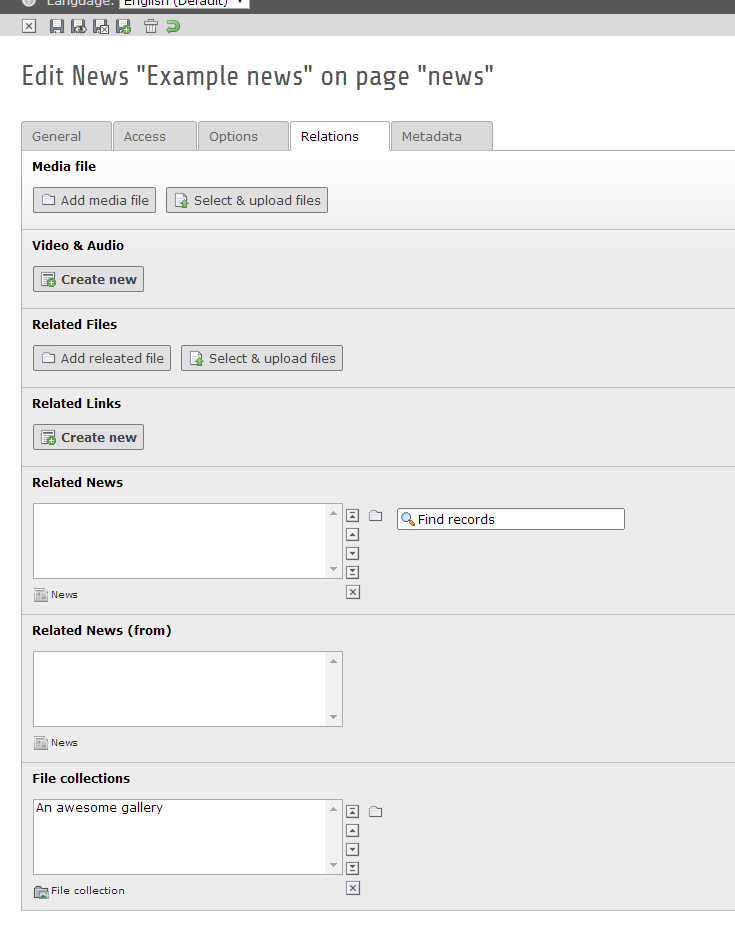

.. ==================================================
.. FOR YOUR INFORMATION
.. --------------------------------------------------
.. -*- coding: utf-8 -*- with BOM.

News gallery: Extend news with file collections
===============================================

About
-----

This extension provides an easy way to file collections to a news record. There are various types of file collections like:

* Static selection of files
* Folder from storage
* Select by category

Requirements
~~~~~~~~~~~~

- TYPO3 6.2
- Extension "news" 3.0.0

Screenshots
~~~~~~~~~~~

How to use
--------------------

Using this extension is simple! Follow this steps:

Creating the records
~~~~~~~~~~~~~~~~~~~~

1. Install the extension. You can get it either from the `TER <http://typo3.org/extensions/repository/view/news_gallery>`_ or from `Github <https://github.com/cyberhouse/t3ext-news_gallery>`_
2. Create a new record "File collection" and define some images.
3. Create a news record or open an existing one, switch to the tab "Relations" and add the previously created record in the new relation.

Adopt the template
~~~~~~~~~~~~~~~~~~

To be able to show the images you need to alter the templates.

1st of all add the namespace declaration at the top of the template: ::

    {namespace gallery=Cyberhouse\NewsGallery\ViewHelpers}

This is just an example snippet which outputs all images of the file collection in a basic list: ::

    <f:if condition="{newsItem.gallery}">
    	<ul>
    		<gallery:render as="images" collection="{newsItem.gallery}">
    			<f:for each="{images}" as="image">
    				<li>
    					<f:image image="{image}" alt="" maxWidth="150" />
    				</li>
    			</f:for>
    		</gallery:render>
    	</ul>
    </f:if>

.. note::

   You can use the gallery in any action of the news extension. No matter if List.html, Detail.html or anything else.

Misc
----

Author
~~~~~~

Author of this extension is Georg Ringer at Cyberhouse GmbH - Full service agency https://www.cyberhouse.at

Contribution & Bug reports
~~~~~~~~~~~~~~~~~~~~~~~~~~

Any contribution is highly welcomed. Please use the bugtracker of the `GitHub Project <https://github.com/cyberhouse/t3ext-news_gallery/issues>`_